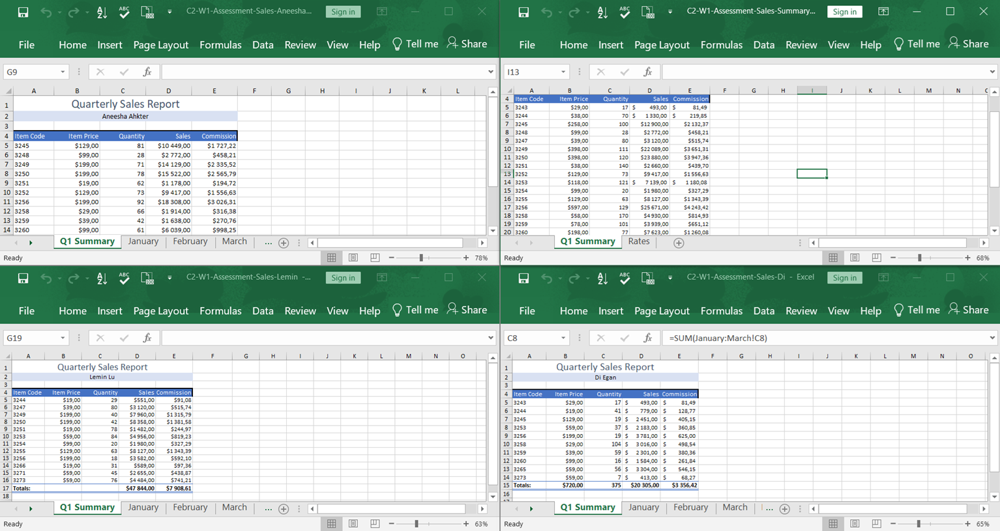
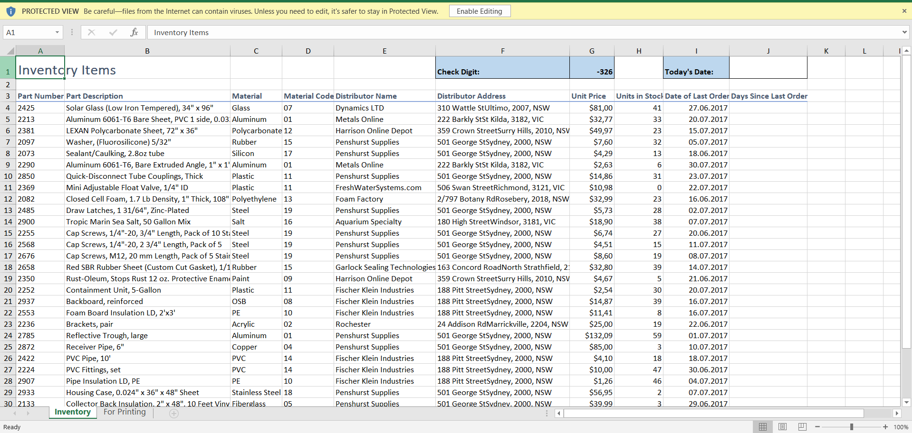
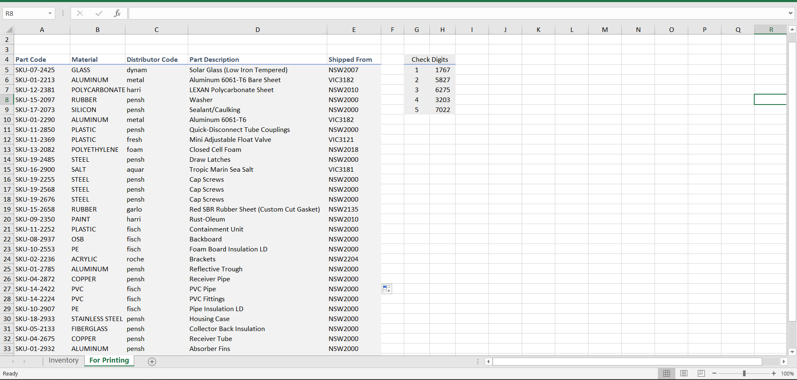
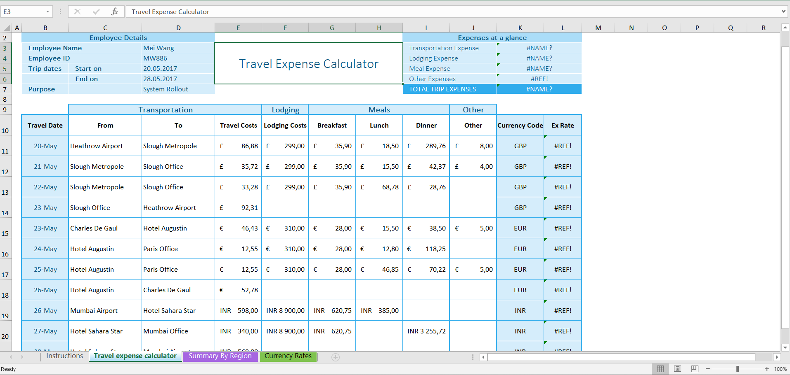
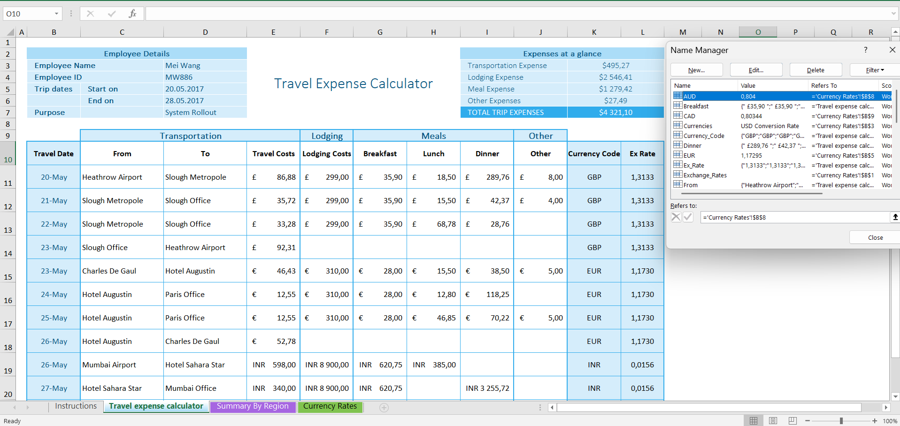
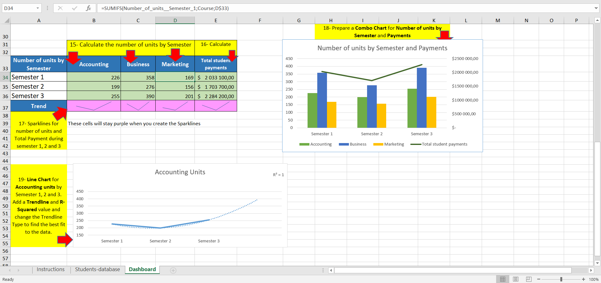
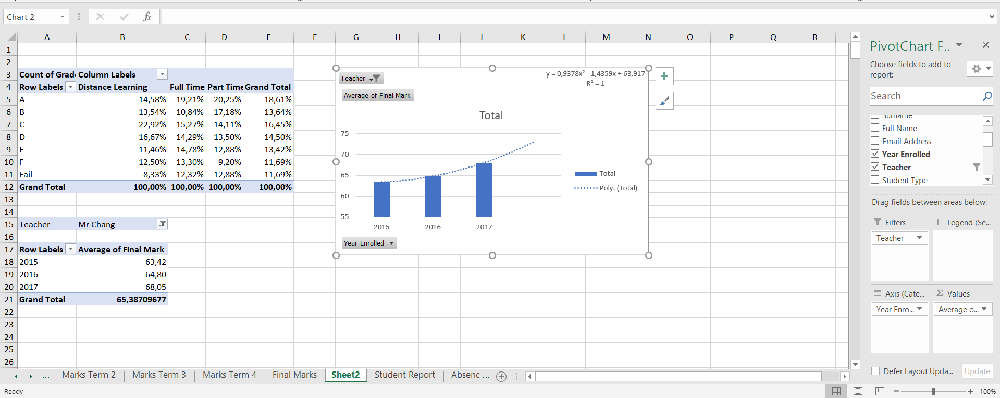

# excel-skills-for-business-intermediate
Weekly assessments and practice projects completed during the Excel Skills for Business: Intermediate course.

## 2026-05-20  C2-W1-Assessment

This project contains a completed Excel assessment focused on multi-workbook operations and sales reporting.

### Skills Practiced

- 3D formulas
- Workbook linking
- Updating broken external links
- Data consolidation
- Sales calculations
- Commission calculations

### Files Included

- Sales Aneesha workbook
- Sales Di workbook
- Sales Lemin workbook
- Consolidated Sales Summary workbook

### Screenshot

## 2026-05-22  C2-W2-Assessment-Workbook

Excel assessment focused on text functions, date calculations, and dynamic data extraction.

### Skills Used

- LEFT / RIGHT / MID
- FIND
- CONCAT
- TODAY
- YEARFRAC
- Dynamic text extraction
- Inventory label generation

### Tasks Completed

- Generated SKU labels
- Extracted postcodes and state codes
- Created distributor codes
- Calculated date differences
- Built dynamic inventory labels

### Before

### After

## 2026-05-25  C2-W3-Assessment-Workbook
Excel assessment focused on repairing broken named ranges and fixing travel expense calculations.

## Skills Practiced

- Named Ranges
- Create from Selection
- Apply Names
- Paste List
- Currency Conversion
- Expense Summaries
- SUM formulas
- Workbook troubleshooting

### Before

### After

## 2026-05-28  C2-W4-Practice-Challenge

Excel practice project focused on data analysis, dashboard creation, aggregation formulas, and data visualization.

### Skills Practiced

- SUMIF / SUMIFS
- COUNTIF / COUNTIFS
- Named Ranges
- Sparklines
- Combo Charts
- Trendlines and R² analysis
- Secondary Axis charts
- Dashboard-style reporting
- Conditional aggregation
- Data visualization in Excel

### Tasks Completed

- Calculated student payments and units by semester
- Built summary tables using conditional formulas
- Created sparklines to visualize semester trends
- Built a combo chart combining units and payments
- Added trendlines and analyzed R² values for best fit
- Used named ranges to simplify formulas and calculations

### Preview

Dashboard containing:
- semester unit analysis,
- payment summaries,
- sparklines,
- combo charts,
- trendline forecasting.

## 2026-06-01  C2-Final-Assessment

Final assessment completed as part of the Excel Skills for Business course.
The project involved building reports, analyzing student performance data, creating Pivot Tables.

### Topics covered:

- 3D formulas
- Named ranges
- COUNTIF / COUNTIFS
- Tables and Total Row
- Filtering and Sorting
- Data Consolidation
- Pivot Tables
- Pivot Charts
- Trendlines and Forecasting
- Sparklines

- ## Tasks Completed

- Calculated student performance metrics using 3D formulas across multiple worksheets
- Built a final reporting sheet combining results from four academic terms
- Created dynamic grade calculations using named ranges and lookup logic
- Generated student email addresses and enrollment years using text functions
- Consolidated attendance data from multiple worksheets into a single report
- Analyzed absence patterns and identified students with high absence rates
- Created Pivot Tables to compare academic performance across student groups
- Built Pivot Charts to visualize grade distributions and performance trends
- Applied trendline analysis and forecasting to predict future student results
- Used filtering, sorting, and summary statistics to support reporting and decision-making
- 
### Final Assessment Preview

### Next Steps

Continue strengthening Excel skills before moving on to SQL, Power BI, and Python as part of my data analytics learning path.
